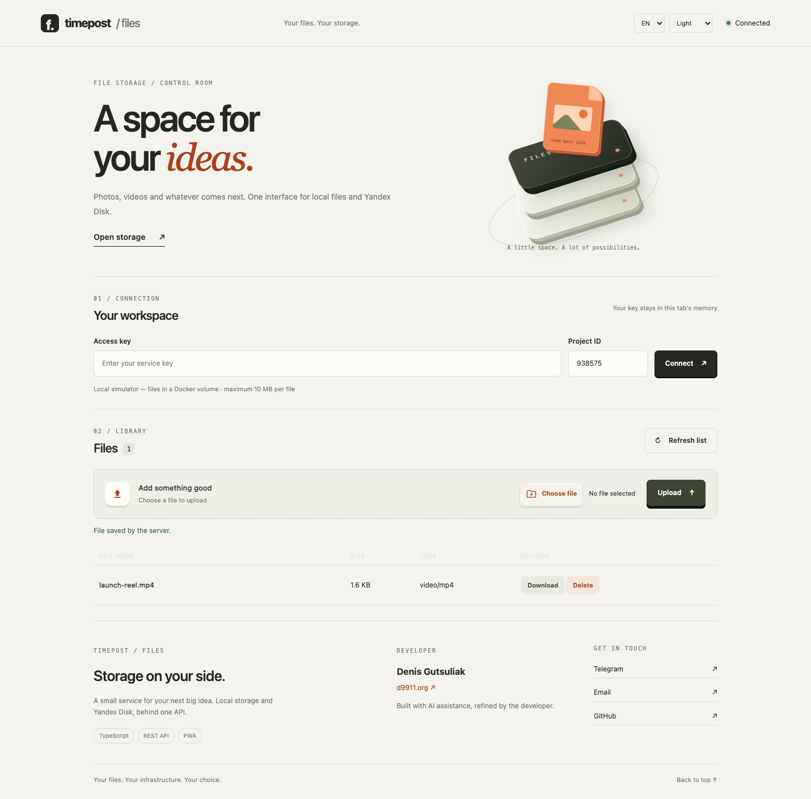
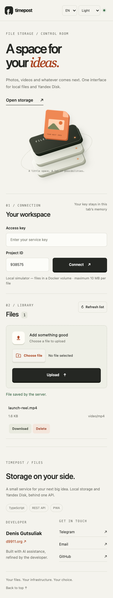
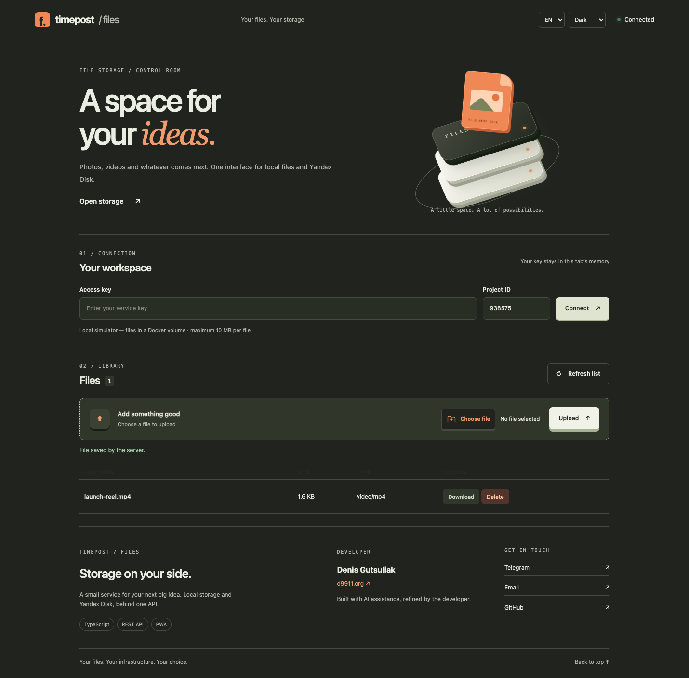

# Timepost Files

[English](README.md) · [Русский](README.ru.md) · [Español](README.es.md)


Private file storage · Yandex Disk, S3 & local provider · TypeScript API & management UI

<details>
<summary>Contents</summary>

[S3-compatible storage](#s3-compatible-storage) · [Technology stack](#technology-stack) · [Standalone quick start](#standalone-quick-start) · [Yandex Disk configuration](#yandex-disk-configuration) · [API and lifecycle](#api-and-lifecycle) · [Timepost integration](#timepost-integration) · [Standalone API examples](#standalone-api-examples) · [Relationship to Yandex Disk](#relationship-to-yandex-disk) · [Hosting on your own server](#hosting-on-your-own-server) · [TypeScript, architecture and documentation](#typescript-architecture-and-documentation) · [References, thumbnails and byte ranges](#references-thumbnails-and-byte-ranges) · [UI preferences and branding](#ui-preferences-and-branding) · [PWA and other formats](#pwa-and-other-formats) · [Author](#author) · [License](#license)

</details>

## S3-compatible storage

S3 means **Simple Storage Service**, not API version 3. Amazon S3 is the AWS service; Selectel and Yandex Object Storage offer compatible APIs. Yandex Disk is a separate product with an OAuth API. Files keeps `/api/v1/files` for all providers; PostgreSQL metadata, authorization, validation and deletion jobs remain in Files.

| `STORAGE_PROVIDER` | Backend                                                                 |
| ------------------ | ----------------------------------------------------------------------- |
| `yandex`           | Existing Yandex Disk adapter                                            |
| `simulator`        | Local filesystem                                                        |
| `selectel`         | Selectel S3 endpoint from your account                                  |
| `aws`              | Amazon S3; endpoint optional, region required                           |
| `yandex-object`    | Yandex Object Storage, `https://storage.yandexcloud.net`, `ru-central1` |
| `s3`               | Other compatible endpoint or local S3Mock                               |

Set `S3_BUCKET`, `S3_REGION`, `S3_ENDPOINT` and `S3_ACCESS_KEY_ID` / `S3_SECRET_ACCESS_KEY` in `.env`, then run `make start`. Use the exact endpoint and region/pool supplied by the provider. `S3_SESSION_TOKEN` supports temporary credentials. AWS without explicit keys uses the SDK credential chain; Docker credentials still need to be supplied to its container. `S3_FORCE_PATH_STYLE=true` is the default; set `false` for virtual-hosted addressing. `S3_KEY_PREFIX=timepost/` namespaces objects. Never put cloud keys in browser code. HTTPS is required for cloud endpoints.

Create a dedicated private bucket **without versioning or prior version history**. Readiness checks its accessibility and versioning; enabled or suspended versioning is rejected because deleting an object by key would not guarantee removal of previous versions. Credentials need HeadBucket, GetBucketVersioning, PutObject, GetObject and DeleteObject permissions. Cloud buckets are not created automatically. No silent local fallback occurs. Changing bucket, prefix or endpoint does not migrate existing files: use a separate database/instance unless performing a verified data migration.

### Local S3 test environment

```sh
make start-s3
make smoke-s3
make logs-s3
make stop-s3
```

Open `http://127.0.0.1:3060` (or `FILES_PORT` from `.env`). All providers use one `timepost-files-standalone` Compose project, one API, PostgreSQL and deletion worker. `make start-s3` selects the local S3 adapter in the shared `.env`, preserving Files keys, database password and port; it adds Adobe S3Mock and bucket initialization to the same project. `make start`, `stop`, `ps`, `logs` and `smoke` automatically use the current provider. The `*-s3` inspection commands are compatibility aliases, not additional installations. Existing cloud configurations are never replaced by `start-s3`.

S3 credentials stay server-side. S3Mock has no published port; it is a test emulator, not production storage or proof of cloud IAM/signature enforcement. Stopping preserves volumes. To return to the filesystem simulator, set `STORAGE_PROVIDER=simulator` in `.env` and run `make start`. Files metadata remains in the shared database; lists are scoped to the selected provider. Switching providers does not copy file bytes or change their recorded provider. Never change an existing S3 bucket/endpoint/prefix without a verified migration.

Earlier installations used `timepost-files-s3` on port 3061 and `.env.s3`. They are legacy deployments: stop them with `docker compose --env-file .env.s3 -p timepost-files-s3 -f compose.yaml -f compose.s3.yaml down` **without `--volumes`**. Keep their configuration and volumes for recovery; legacy data is not imported automatically. New commands never create this second project.

Sources: [Amazon S3](https://docs.aws.amazon.com/AmazonS3/latest/userguide/Welcome.html), [Selectel S3](https://docs.selectel.ru/api/object-storage-s3/), [Yandex Object Storage](https://yandex.cloud/ru/docs/storage/s3/), [Adobe S3Mock](https://github.com/adobe/S3Mock). Real cloud tests require provider credentials and have not been performed.

## Technology stack

| Component            | Implementation                                      |
| -------------------- | --------------------------------------------------- |
| Runtime              | Node.js 24, native HTTP server                      |
| Language             | TypeScript 5.9, strict type checking                |
| Metadata & job queue | PostgreSQL 16                                       |
| Storage providers    | Yandex Disk / AWS SDK S3 adapter / local filesystem |
| Media processing     | Sharp / ffprobe                                     |
| Management UI        | TypeScript, CSS, Web Manifest & service worker      |
| API documentation    | OpenAPI / Redocly                                   |
| Code quality         | ESLint / Prettier / Node.js test runner             |



**Private files, a clearer view.** A lightweight management UI with a CSS 3D storage illustration, subtle motion and responsive file rows. The screenshots show real local simulator uploads in a dedicated demonstration workspace; no access keys are visible. Motion respects `prefers-reduced-motion`.

<details>
<summary>Mobile storage interface</summary>



</details>

<details>
<summary>Dark theme / Spanish</summary>



</details>

A private REST file-storage service built with Node.js 24 and TypeScript. It runs an API, PostgreSQL and a deletion worker. File bytes are stored on Yandex Disk, S3-compatible storage or through an explicitly selected local filesystem provider (`simulator`). The management UI uses plain TypeScript.

## Standalone quick start

Run `make start` from this directory. It installs build dependencies, compiles the service, creates `.env` with random service keys and a database password, builds Docker containers and waits for readiness. Existing configuration and volumes are preserved. Standalone use requires this directory, Docker Compose and Node.js 24; neighboring Timepost repositories are optional.

From the Timepost workspace root, use `make files-standalone`. The fallback entry point is `make -f scripts/main/Makefile files-standalone`.

To start both projects from the Timepost workspace, use `make dev-file` (local frontend development) or `make start-file` (Docker build and startup). They build and start standalone Files first, then the regular Timepost mode, and open Timepost, Admin and Files after readiness. Use `OPEN_BROWSER=false` to disable opening. Both commands also work via `make -f scripts/main/Makefile`. Existing commands keep their behavior. Standalone Files has separate data and keys; it rebuilds on command invocation, without hot reload. For a custom port use `FILES_PORT=4060 FILES_UI_URL=http://127.0.0.1:4060`. Stop standalone containers with `make -C files stop` from the workspace.

Open <http://127.0.0.1:3060>, enter `FILES_API_KEY` from your local `.env` and choose a numeric workspace ID. The UI supports listing with load-more pagination, uploading, downloading and queuing deletion. The key stays in page memory. `FILES_READONLY_API_KEY` grants read-only access.

Standalone keys apply to the whole instance, including all workspaces; they are service credentials rather than per-user permissions. The HTTP port binds to loopback. Cloud OAuth credentials stay on the server. Keep `.env` private.

| Command                         | Purpose                                               |
| ------------------------------- | ----------------------------------------------------- |
| `make start`                    | Build and start API, PostgreSQL and worker            |
| `make ps` / `make logs`         | Inspect containers and API/worker logs                |
| `make stop`                     | Stop containers while preserving data                 |
| `make config`                   | Validate Compose without printing secrets             |
| `make smoke`                    | Test the simulator and remove only its own test files |
| `make test-db`                  | Exercise PostgreSQL insert/get/list with rollback     |
| `make build` / `make typecheck` | Compile / check strict TypeScript                     |
| `make test` / `make lint`       | Run tests / ESLint and formatting checks              |
| `make docs`                     | Generate standalone HTML API documentation            |

The workspace equivalent of `make smoke` is `make files-smoke`.

### Obtaining and replacing an access key

Run `make setup` in `files/` to create a private `.env` on first use; existing keys are preserved. Copy `FILES_API_KEY` from that file into the UI Access key field, or use `FILES_READONLY_API_KEY` for read-only access. HTTP clients send `Authorization: Bearer <Files key>`. S3 credentials cannot authenticate to Files.

Generate a new test key:

```sh
node -e "console.log(require('node:crypto').randomBytes(32).toString('hex'))"
```

Copy the result into `FILES_API_KEY` or `FILES_READONLY_API_KEY` in `.env`, then run `make start`. Generate different values for the two roles; at least 32 characters are required. The replaced key stops working after the API is recreated. `make setup` does not rotate keys. Leave `FILES_DB_PASSWORD` unchanged.

The instance accepts one owner key and one readonly key across all workspaces. Client registration and independently issued per-client keys are not implemented. Use Timepost mode with Accounts/Projects for user permissions. Keep `.env` and keys out of Git and URLs; never enter cloud credentials in the browser.

## Yandex Disk configuration

Set `STORAGE_PROVIDER=yandex` and `YANDEX_DISK_OAUTH_TOKEN` in `files/.env`, then run `make start` again. The token needs access to the application folder `app:/timepost`; see the [official REST API and OAuth documentation](https://yandex.ru/dev/disk/rest/).

Metadata remains in PostgreSQL; bytes are uploaded to Disk. Cloud errors do not trigger a fallback to local storage. Records belonging to another provider are hidden from listings; metadata/content requests for them return a provider-mismatch error. Personal Disk connections for individual users and Google Drive support are not implemented. Real cloud execution requires a valid token and has not been verified.

## API and lifecycle

The contract is available as [openapi.json](openapi.json) and [openapi.yaml](openapi.yaml). Run `npm run openapi:generate` to regenerate it or `npm run openapi:check` to check it. There is no exposed HTTP Swagger endpoint. This is the service's own REST API, rather than a GraphQL schema or an exact copy of the Yandex Disk HTTP API.

| Request                                              | Behavior                                                    |
| ---------------------------------------------------- | ----------------------------------------------------------- |
| `POST /api/v1/files?projectId=1&fileName=photo.png`  | Upload raw bytes with Bearer authentication                 |
| `GET /api/v1/files?projectId=1&limit=20&cursor=UUID` | List ready files with cursor pagination                     |
| `GET /api/v1/files/{id}`                             | Read metadata                                               |
| `GET /api/v1/files/{id}/content`                     | Download private content                                    |
| `DELETE /api/v1/files/{id}`                          | Return HTTP 202 and queue durable deletion                  |
| `GET /api/v1/files/{id}/deletion`                    | Read deletion status and attempts, including after deletion |
| `GET /api/v1/storage`                                | Read sanitized storage capabilities                         |
| `GET /health/ready`                                  | Check readiness                                             |

Images and generic files are limited to 10 MiB (`10 × 1024 × 1024` bytes); videos to 100 MiB (`100 × 1024 × 1024` bytes). JPEG/PNG/WebP must decode successfully, contain one frame and fit within 4096 × 4096 pixels. ffprobe validates MP4 H.264/AAC and WebM VP8/VP9 with Opus/Vorbis: one video stream, at most one audio stream, up to 4096 × 4096 pixels and 60 minutes. Metadata includes `durationSeconds`.

HEIC, AVI, MOV, transcoding, poster extraction and full video decoding are not implemented. Authenticated video downloads use a Blob and the existing player; The content API supports a single HTTP byte range; resumable uploads are not supported. Standalone generic files are stored as `application/octet-stream` and downloaded as attachments. Antivirus scanning is not implemented.

Downloads verify size and SHA-256. Uploads become `ready` after provider confirmation. The worker queues cleanup for unfinished `pending` uploads older than 24 hours.

File deletion transitions through `deleting` → `deleted`; jobs use `pending` → `running` → `done`, retry or `failed`. PostgreSQL provides the durable queue and a 120-second lease. A job stops after 10 processed failures; repeating DELETE restarts a stopped job. Deleted metadata is retained for audit. This queue does not require Redis, Kafka or RabbitMQ. API migrations run serially under a database lock. Configure volume/cloud backups separately.

## Timepost integration

Workspace `make start`, `make dev` (an alias for `dev-local`), `make dev-docker` and `make dev-local` include Files. `make files-start` starts Files and its dependencies. The main stack defaults to the simulator with Accounts sessions and Projects access checks. For cloud storage, set `FILES_STORAGE_PROVIDER=yandex` and `YANDEX_DISK_OAUTH_TOKEN` in the root `.env`.

The frontend uses `/api/files-service`. Posts validates `mediaFileId` through Files. Timepost deletion protects referenced and legacy unregistered files. Standalone service keys do not replace Timepost user permissions.

`make dev` already prepares seed data. `make seed` adds missing demo records in Accounts/Projects/Posts/Notifications and the Analytics catalog; it does not reset an existing database. Files creates bytes through successful uploads, rather than fabricated seed files. Restarting or seeding does not clear its volumes.

Editor data flow: browser → `/api/files-service/api/v1/files` → Files → storage provider. The browser then submits `mediaFileId` to Posts. Posts checks metadata using the user session and stores the image/video type, dimensions and reference. Reopening the editor returns the saved ID without requiring another upload. Reels and Stories use the same storage flow; this does not confirm delivery to a social network.

Avatar and cover images can technically be stored as project images. Persisting their references requires the owning Accounts/Projects contract. Automatic integration of all avatars, covers and chat attachments is not implemented.

## Standalone API examples

Export the service key locally from your `.env`; do not embed it in documentation. Timepost uses a user Bearer token instead.

```sh
# Upload an image; the response contains data.mediaFileId.
curl --fail-with-body -H "Authorization: Bearer $FILES_API_KEY" \
  -H 'Content-Type: image/jpeg' --data-binary @photo.jpg \
  'http://127.0.0.1:3060/api/v1/files?projectId=1&fileName=photo.jpg'

# For MP4 uploads, use video/mp4 and the corresponding file path.
# List files.
curl --fail-with-body -H "Authorization: Bearer $FILES_API_KEY" \
  'http://127.0.0.1:3060/api/v1/files?projectId=1&limit=20'

# Set FILE_ID to the UUID returned by the upload.
curl --fail-with-body -H "Authorization: Bearer $FILES_API_KEY" \
  "http://127.0.0.1:3060/api/v1/files/$FILE_ID/content" --output saved-file
curl --fail-with-body -X DELETE -H "Authorization: Bearer $FILES_API_KEY" \
  "http://127.0.0.1:3060/api/v1/files/$FILE_ID"
curl --fail-with-body -H "Authorization: Bearer $FILES_API_KEY" \
  "http://127.0.0.1:3060/api/v1/files/$FILE_ID/deletion"
```

## Relationship to Yandex Disk

Both providers implement the same internal `ready/upload/download/delete` interface and preserve the external Files contract.

| Files operation | Yandex Disk adapter                         | Local simulator              |
| --------------- | ------------------------------------------- | ---------------------------- |
| Preparation     | `PUT /resources` for `app:/timepost`        | Create storage directory     |
| Upload          | `/resources/upload`, followed by binary PUT | Write and sync a UUID file   |
| Content         | `/resources/download`, followed by GET      | Read a UUID file             |
| Delete          | `DELETE /resources` with `permanently=true` | Unlink a UUID file           |
| List/metadata   | This service's PostgreSQL metadata          | The same PostgreSQL metadata |

OAuth is sent only to the Disk API. Temporary transfer URLs stay on the server; HTTPS and domains are checked, and redirects are rejected. A provider HTTP 202 does not mean a completed upload; unfinished operations remain pending. See the [adapter implementation](src/modules/files/infrastructure/storage/yandex-disk-storage.ts), [Yandex REST API](https://yandex.ru/dev/disk/rest/), [Disk API introduction](https://yandex.ru/dev/disk-api/doc/ru/) and [OAuth application registration](https://www.yandex.ru/dev/id/doc/ru/register-client). The adapter still needs a real-token cloud test.

## Hosting on your own server

The explicit `simulator` provider stores real bytes in the persistent `objects` volume and metadata in `metadata`. It can run on your server. Configure backups for both volumes, an HTTPS reverse proxy and separate service keys. Keep PostgreSQL private; Compose binds HTTP to loopback by default. User registration belongs to Accounts in Timepost; standalone mode uses service keys.

Switching `simulator` ↔ `yandex` changes the provider for new uploads without migrating existing bytes. Provider-mismatched records are unavailable. Migration would require copying bytes, verifying checksums and updating metadata; that procedure is not implemented.

Without Docker, install PostgreSQL, Node.js 24 and ffprobe on PATH. Run `npm ci`, export settings from `.env.example`, then `npm run build` and `npm start`. Start a separate worker with `FILES_ROLE=worker npm start`. Node does not automatically load `.env`.

## TypeScript, architecture and documentation

The API, worker, adapters, scripts, tests and UI source use TypeScript with `strict` and `noUncheckedIndexedAccess`. Build errors prevent emission. `npm run build` cleans generated `dist/`, compiles the code and copies UI assets/test fixtures. `npm start` runs `dist/src/server.js`. The multi-stage Docker build produces a runtime with production dependencies, migrations, ffmpeg and compiled API/worker/UI.

```text
src/
  app/                         dependency composition and API/worker bootstrap
  modules/
    files/
      domain/                  file model, statuses and limits
      application/             file operations and deletion processing
        ports/                 repository, storage, media and identity contracts
      infrastructure/          PostgreSQL, Yandex Disk, filesystem, sharp/ffprobe
      presentation/            HTTP handlers, DTOs and OpenAPI
      contracts.ts             public module types
    access/
      application/             authorization and project-access contract
      infrastructure/          Accounts/Projects JWT and standalone API keys
      contracts.ts             public access types
  shared/                      errors, guards and infrastructure contracts
  server.ts                    stable entry point
```

`FileService` receives interfaces through constructor injection. Application errors have typed codes; the HTTP layer maps them to statuses. Media validation and UUID/checksum generation are adapters. Application byte contracts use `Uint8Array` and `AsyncIterable`, independently of sharp, PostgreSQL and HTTP `Response`. Dependencies are wired in `app/create-file-service.ts` and `app/bootstrap.ts`.

Domain types live in `modules/files/domain/file.ts`, ports in `application/ports`, and HTTP DTOs in `presentation/http/file-dto.ts`. The UI reuses DTOs through `import type`. Public types are exported through the files/access `contracts.ts` files. The architecture test checks dependency direction and access through module contracts.

Run `npm run typecheck`, `npm test`, `npm run lint` and `npm run format:check` for verification. `make test-db` rolls back its database changes. `make smoke` creates PNG, MP4 and generic files, verifies reads and deletes its own files.

`npm run openapi:docs` / `make docs` generates `documentation/index.html` using the local Redocly development dependency. Generated `dist/` and `documentation/` are excluded from Git.

In the full workspace, `make api-sync` updates contracts and consumer snapshots; `make api-check` checks code consistency and lints OpenAPI. `make api-docs` is a separate manual HTML/JSON/YAML/ZIP export to `archive/docs/`; `archive/docs/api/index.html` provides service navigation. These exports are not required at runtime and are not rebuilt by dev, seed or api-sync. Shared Redocly tooling lives in Scripts, not in the frontend. `public/index.html` is the management UI; `archive/docs/api/files.html` is an API reference. Workspace generators: [contracts](../scripts/openapi-contracts.mjs), [HTML/ZIP](../scripts/openapi-handoff.mjs).

Workspace `make files-integration-smoke` checks Accounts/Projects → Files → Posts Reels draft → reopen/update → private content. It needs seeded credentials/project from local `.env.seed`, removes its own post and file, waits for the deletion worker and closes its test session. It does not publish to social networks.

Optional workspace verification reports: [standalone service](../archive/docs/reports/2026-10-02-files-standalone.md), [media integration](../archive/docs/reports/2026-10-02-files-media-integration.md), [architecture refactor](../archive/docs/reports/2026-10-02-files-clean-architecture.md).

## References, thumbnails and byte ranges

Posts registers a stable `post:<id>` through internal `POST /api/v1/internal/file-references` with `{projectId, referenceId, fileIds, cleanupRemoved}`. Requires an HS256 system JWT for `posts-service`, `files:references:write`, configured issuer/audience. User sessions and standalone keys cannot use this route. Ready files must belong to the same project; file locks serialize registration and deletion.

After permanent deletion commits, release with `fileIds: []`, `cleanupRemoved: true`. Only previously referenced files with zero remaining references are queued. Failed saves can leave safe retained references requiring reconciliation. Legacy unregistered files remain protected. Public deletion requires `FILES_DELETE_ENABLED=true`, uploader identity, project write access and zero references; Timepost permits deletion of new uploads with complete reference tracking, including unused uploads before their first registration. Never release before the owning transaction commits.

Private `GET /api/v1/files/{id}/thumbnail` generates WebP within 512×512 for images. Content supports a single `Range: bytes=...` (206/416). Authorization and full source checksum verification remain. The full source is still downloaded: Range reduces client response size, not provider traffic. Thumbnails are generated on demand without persistent cache; video posters are not implemented.

Requests return a validated `X-Request-Id` and `Server-Timing: app`; correlation propagates to Accounts and Projects. Set `HTTP_REQUEST_LOG_ENABLED=true` for sanitized route/status/duration logs without tokens or query values. Concurrent buffered downloads and thumbnail conversions are capped at four per API instance (429 when busy).

Files uploaded before the reference-tracking migration stay protected even after their first registration, because older posts may still reference them. They require a complete verified backfill before cleanup can be enabled.

Run `make test-references` after rebuilding to verify reference protection against the standalone PostgreSQL. The check creates only its own metadata, no stored bytes, and removes those rows.

## UI preferences and branding

Rows include a Preview action: authenticated raster images/GIF, video and recognized audio files open in a modal with native playback controls. Closing the backdrop, close button or Escape cancels loading, stops playback and releases the Blob URL. SVG and HTML are not rendered. Before upload, all filename pages are checked; duplicate names offer a suggested suffix or keeping the original name. This is an advisory UI check; server UUIDs prevent overwriting, including concurrent uploads. Sections appear on entry, with reduced-motion support.

The UI defaults to English and supports Russian and Spanish. Choose light, dark or system theme in the sticky header. Only these preferences are stored in local storage; access keys remain in tab memory.

Run `npm run icons:generate` to rebuild PNG sizes (16–1024 px), SVG/ICO favicons, an Apple touch icon, a maskable icon, a social preview and `public/manifest.webmanifest`. Source: `assets/branding/icon.svg`; generated browser assets: `public/icons/`; TypeScript UI modules: `public/*.ts`. `npm run build` compiles the modules and copies browser assets into `dist/public/`. A versioned service worker caches only the public UI shell; API requests and private files always require the server. See [deployment security](SECURITY.md).

The file picker uses a themed SVG control with a keyboard focus outline. The sticky header hides on downward scroll and returns on upward scroll or keyboard focus. Sections appear once when entering the viewport; reduced-motion mode keeps them visible without animation. The scrollbar follows the light/dark palette (gradient in Chromium, a solid color in Firefox). The footer links to the developer and repository. Scroll work is limited to one animation frame at a time, with a passive listener and one-time intersection observation.

## PWA and other formats

The manifest lists every generated PNG size (16–1024 px) and the maskable icon. The browser selects an appropriate icon; listing sizes does not download them all. The service worker precaches only the public shell and its main icons. API paths, authorization headers, query strings, uploads and private content are excluded. Updates wait until the old tabs close; the new worker removes only previous Files shell caches.

After the first successful online load, the interface can reopen offline. An offline notice disables server actions. There is no offline upload queue or cached file library. Deployment needs HTTPS; loopback is supported for local development. See [service worker lifecycle](https://developer.mozilla.org/en-US/docs/Web/API/Service_Worker_API/Using_Service_Workers).

With `FILES_GENERIC_ENABLED=true` (standalone default), audio, animated GIF, SVG and arbitrary files retain their original bytes and names but use `application/octet-stream` and attachment download. SVG is not rendered inline. These attachments have a 10 MiB limit, no thumbnail or server-side format validation; validated JPEG/PNG/WebP and MP4/WebM remain separate (video limit 100 MiB). Accepting a file for storage does not make it publishable through a social network.

## Author

Denis Gutsuliak · [d9911.org](https://d9911.org).

## License

Read the complete terms in [LICENSE](LICENSE).

[](LICENSE)
